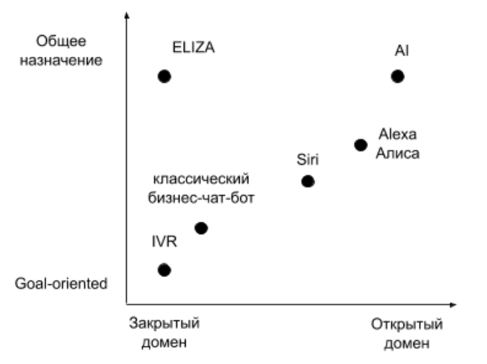

# GEEKBRAINS

## Разработчик. Программист. Цифровые профессии

Дипломный проект
***
### Telegram - бот Formula1
***

___Воропаев Олег Владимирович___

___2023___

### ВВЕДЕНИЕ

Телеграмм-бот о Формуле 1 - идеальное решение для всех фанатов этого захватывающего спорта. Этот бот позволяет быть в курсе последних новостей, расписания гонок и получать информацию о пилотах. Вот почему каждый, кто интересуется Формулой 1, должен иметь этого бота:

1. Последние новости: 
   - Телеграмм-бот обновляется в режиме реального времени, поэтому вы всегда будете первыми, кто узнает о последних событиях и разработках в мире Формулы 1. 
   - Получайте свежие новости о командах, гонках, изменениях в составе и других интересующих вас моментах.

2. Расписание гонок: 
   - Важно знать, когда и где пройдет следующая гонка Формулы 1. 
   - Телеграмм-бот предлагает полное и обновляемое расписание, позволяя вам быть готовыми к каждой гонке. 
   - Вы не пропустите ни одной эпохальной гонки.

3. Информация о пилотах: 
   - Хотите знать больше о вашем любимом пилоте или следить за достижениями новичков? 
   - Телеграмм-бот предоставляет полезную информацию о пилотах, их командах, статистике и других интересных фактах. 
   - Получайте полную картину о каждом пилоте Формулы 1.

4. Удобство и простота: 
   - Этот телеграмм-бот предоставляет информацию в удобном и доступном формате. 
   - Нет необходимости искать и открывать различные сайты или приложения - все, что вам нужно, можно получить в одном месте, просто введя соответствующую команду.

5. Персонализация: 
   - Телеграмм-бот позволяет настроить уведомления и получать информацию только о тех новостях или гонках, которые вас интересуют. 
   - Выбирайте наиболее важные элементы Формулы 1 для себя и наслаждайтесь персонализированным опытом.

В итоге, телеграмм-бот про Формулу 1 предоставляет фанатам этого захватывающего спорта удобный и непрерывный доступ к самой свежей информации. Будьте в курсе всех событий, получайте полезную информацию и наслаждайтесь каждой гонкой Формулы 1 благодаря этому удобному боту.

Данный чат-бот может предлагать посмотреть ближайшую гонку Формулы 1 в кафе или ресторане, а также заказать там столик.

Для выполнения поставленной цели необходимо решение следующих задач:

- Изучить понятия чат-бота и его функции.
- Рассмотреть преимущества использования мессенджеров.
- Рассмотреть языки программирования и выбрать язык для разработки чат-бота.
- Выбрать мессенджер, в котором будет реализован чат-бот.
- Изучить и составить полную архитектуру.
- Разработать чат-бот.
- Продемонстрировать концепцию разработки.

### Чат-бот и его функции

Чат-бот — это программа, которая имитирует человеческое общение. Алгоритм бота ориентирован как на ведение неструктурированного диалога, так и на решение поставленных клиентом задач. Большое распространение боты получили в бизнесе, как в высококонкурентной среде, где особенно важна
клиентская поддержка. Аналитики KPMG поставили чат-ботов на вторую строчку среди самых популярных инструментов цифровизации у российских компаний (на первом месте — большие данные и предиктивная аналитика).
Подходы и технологии, используемые при создании бота, зависят от типа и
назначения системы. Классификация диалоговых систем опирается на 2 критерия:  
● Ориентированность на задачу (goal-oriented) VS общее назначение  
● Закрытая VS открытая предметная область (домен)  
Goal-oriented боты разрабатываются для решения конкретных задач - выдачи
информации по запросу, выполнения операций (проверка баланса, подключение
тарифа). Диалоговые системы общего назначения (так называемые
боты-”болталки”) направлены исключительно на поддержание диалога и
развлечение пользователя. Системы с закрытым доменом выполняют задачи или ведут диалог,ограниченный узкой предметной областью, например банковской или медицинской сферой. Системы с открытым доменом предполагают
универсальные возможности использования - к ним относятся ассистенты типа Алексы от Amazon или Алисы от Яндекса.
Сложность разработки чат-бота возрастает по мере расширения его предметнойобласти и генерализации назначения (или увеличения количества задач, которые он способен выполнять).  
Вот пример классификации некоторых чат-ботов по
данным критериям:
    
Для большинства бизнес-задач достаточно goal-oriented бота с ограниченной
областью знаний; стремление охватить все предметные сферы и создать
универсального собеседника в теории может привести к созданию “настоящего”
искусственного интеллекта.

## Преимущества использования мессенджеров
Мессенджеры становятся все без исключения наиболее распространенным
каналом коммуникации, захватывая в том числе и общественное место с
поддержкой чатов и каналов.
 Уже в настоящее время возможно сказать о том, то что каналы в
мессенджерах стало быть комфортной основой пользования контента для
множества пользователей соцмедиа. В потреблении новостного контента
пользователи Телеграмма выбирают подборки с анонсами новостей с агрегаторов
и эти каналы, которые публикуют медиа-контент 1-2 раза в день – аудитория у
них существенно обширнее, нежели, к примеру, у СМИ, бомбящих подписчиков
новостями в течении всего дня.
 Использование мессенджеров отнюдь не только лишь для индивидуального
общения, но и для общения в публичных чатах и чтения публичных каналов –
что является одним из трендов 2019 года. Чаты и каналы превращают
мессенджеры в соц медиа и завлекают новых пользователей. Тренд-сеттером здесь
бесспорно представляет собой Телеграмм, то что, возможно, и ориентирует
мессенджер расширяться столь внушительными темпами.
 Резюмируя, только и остается заметить, то что тренд увеличения интереса к
мессенджерам непрекращается. В совокупном фоне двойного увеличения объема
упоминаний, фаворитом роста с четырехкратным показателем стал Телеграмм.
Увеличение интереса к Телеграмму связан, с активным применением публичных
каналов – из-за год в год количество пользователей русскоязычных каналов
умножилось в разы – с сотен вплоть до 10-ов тыс.. Более интенсивное
увеличение показали каналы с редким авторским контентом – увеселительным,
образовательным, и каналы с важной информативной повесткой дня и политикой.
Функционал мессенджеров, в частности, Телеграмм, нацелен в первую
очередность в мобильную аудиторию, стремительно использующую телефоны с
целью работы или отдыха: пользователю отнюдь не необходимо заходить в вебсайт, довольно отправить сообщение боту.С чат-ботом все без исключения по другому – пользователь способен
получать моментальный отклик на свои вопросы.
 Близость, быстрота и перечень возможностей – вот на чем
раскручиваются мессенджеры. Подводя вывод, можно отметить последующие достоинства в применении
мессенджера Телеграмм :
• Увлекательность – чат-бот возможно усовершенствовать увлекательным
перечнем возможностей, подобным, как игры, выборочные опросы и прочие
формы взаимодействия, предрасположенные «вовлечь» пользователя в диалог.
• Мобильность и популярность согласно платформам – Телеграмм считается
кроссплатформенным приложением, легкодоступным не только лишь с
мобильного телефона, однако и с личного пк.
• Мгновенность и защищенность – разработчики Телеграмм не один раз
высказывали о его защищенности, что осуществляется вследствие применения
оригинального алгоритма шифрования MTProto.
• Доступность и глобальность – не имеется практически никаких ограничений. 

## Языки программирования для бота

В современном мире очень многое завязано на IT-технологиях,
практически в любой компании работники используют различные приложения
для эффективной и качественной работы, мир не стоит на месте, а развивается и
тематика данной статьи обусловлена тем, что в рамках дипломной работы есть
идея написания развлекательного чат-бота в мессенджере Telegram, который будет предоставлять информацию фанатам Формулы 1, а для
написания чат-бота необходимо выбрать язык программирования от которого
будет зависеть быстрота написания кода, возможности языка и т.д. 
Язык программирования — это набор правил, которые определяют, как
выглядит написанная компьютерная программа и что компьютер может делать
под ее контролем. Программа — это код, написанный в соответствии с
правилами данного языка программирования. Код, из которого состоит
программа, называется «исходным кодом».
Языки программирования — это формальные искусственные языки. Как и
естественные языки, они имеют алфавит, словарный запас, грамматику и
синтаксис, а также семантику.
Алфавит — разрешенный к использованию набор символов, с помощью
которого могут быть образованы слова и величины данного языка.
Синтаксис — система правил, определяющих допустимые конструкции
языка программирования из букв алфавита.
Семантика — система правил однозначного толкования каждой языковой
конструкции, позволяющих производить процесс обработки данных.
Все языки программирования делятся на два вида — языки низкого и
высокого уровня:
Языки низкого уровня — это способ написания компьютерных
инструкций на аппаратном языке, то есть в машинных кодах (в виде
последовательности нулей и единиц). Языки низкого уровня жестко
ориентированы на конкретный тип оборудования (система
управления процессором, каждый тип процессора имеет свой
машинный код).
Языки высокого уровня — это языки программирования, которые
позволяют записывать программы в удобной для человека форме.
Эти языки ориентированы не на систему инструкций того или иного
процессора, а на систему операторов (инструкций), характерную для
написания определенного класса алгоритмов.Языки высокого уровня проще в использовании, поскольку их задача -
обслуживать потребности программиста, а не определять возможности
компьютера. Программы, написанные на этих языках, должны быть
перекодированы - переведены на машинный язык, чтобы перед запуском
программ компьютер мог их понять. Поэтому системы программирования на
Java включают в себя либо интерпретатор языка, либо компилятор.
Языки низкого уровня, близкие к машинному языку, позволяют создавать
программы, которые работают быстрее и позволяют более эффективно
использовать ресурсы компьютера. Самыми популярными
языками на данный момент, являются JavaScript, Python и С#, поэтому для
анализа и сравнения выберем именно эти языки.  
Python —  
это высокоуровневый язык программирования общего
назначения, который также используется для разработки веб-приложений. Язык
нацелен на повышение производительности труда разработчиков и
читабельности кода.
Python поддерживает различные парадигмы программирования:
структурную, объектно-ориентированную, функциональную, императивную и
аспектно-ориентированную. Язык включает в себя динамическую типизацию,
автоматическое управление памятью, полное самонаблюдение, механизм
обработки исключений, поддержку многопоточных вычислений и практические
структуры данных высокого уровня.  
*Преимущества Python:*
+ открытая разработка;
+ довольно прост в изучении, особенно на начальном этапе;
+ особенности синтаксиса стимулируют программиста писать хорошо
читаемый код;
20
+ предоставляет средства быстрого прототипирования и
динамической семантики;
+ имеет большое сообщество, позитивно настроенное по отношению к
новичкам;
+ множество полезных библиотек и расширений языка можно легко
использовать в своих проектах благодаря предельно
унифицированному механизму импорта и программным
интерфейсам;
+ механизмы модульности хорошо продуманы и могут быть легко
использованы;
+ абсолютно всё в Python является объектами в смысле ООП, но при
этом объектный подход не навязывается программисту.  
*Недостатки Python:*
+ не слишком удачная поддержка многопоточности;
+ на Python создано не так уж много качественных программных
проектов по сравнению с другими универсальными языками
программирования, например, с Java;
+ отсутствие коммерческой поддержки средств разработки (хотя эта
ситуация со временем меняется);
+ изначальная ограниченность средств для работы с базами данных;
+ бенчмарки показывают меньшую производительность Python по
сравнению с основными Java VM, что создаёт этому языку
репутацию медленного. 

JavaScript  
— мультипарадигменный язык программирования.
Поддерживает объектно-ориентированный, императивный и функциональный
стили. 

*Преимущества JavaScript:*  
+ Ни один современный браузер не обходится без поддержки JavaScript.
+ С использованием написанных на JavaScript плагинов и скриптов
справится даже не специалист.
+ Полезные функциональные настройки.
+ Постоянно совершенствующийся язык – сейчас разрабатывается
бета-вариация проекта, JavaScript2.
+ Взаимодействие с приложением может осуществляется даже через
текстовые редакторы – Microsoft Office и Open Office.
+ Перспектива использования языка в процессе обучения
программированию и информатике.  
*Недостатки JavaScript:*  
+ Пониженный уровень безопасности ввиду повсеместного и
свободного доступа к исходным кодам популярных скриптов.
+ Множество мелких раздражающих ошибок на каждом этапе работы.
Большая часть из них легко исправляется, но их наличие позволяет
считать этот язык менее профессиональным, сравнительно с
другими.
+ Повсеместное распространение. Своеобразным недостатком можно
считать тот факт, что часть активно используемых программ
(особенно приложений) перестанут существовать при отсутствии
языка, поскольку целиком базируются на нем.  

C# —  
язык программирования, сочетающий объектно-ориентированные и
контекстно-ориентированные концепции.  
*Преимущества:*
+ для малых предприятий и некоторых отдельных разработчиков
бесплатные инструменты включают Visual Studio, Azure Cloud,
Windows Server, Parallels Desktop для Mac Pro и многие другие;
+ большое количество синтаксических конструкций, разработанных
для лучшего понимания написания кода;
+ очень прост в изучении;
22
+ после покупки Xamarin на C # вы можете писать программы и
приложения для операционных систем, таких как iOS, Android,
MacOS и Linux;
+ имеется целое сообщество из опытных программистов.

*Недостатки:*
+ приоритетная ориентированность на Windows платформу;
+ язык бесплатен только для небольших фирм, индивидуальных
программистов, стартапов и учащихся. Крупной компании покупка
лицензионной версии этого языка обойдется в круглую сумму;
+ в языке осталась возможность использования оператора
безусловного перехода.

Чаще всего в качестве языка программирования для чат-бота выбирают
Python. Приведем несколько примеров преимуществ создания бота на Python:
+ Ваши возможности практически безграничны.
+ Экономия денег.
+ Получения навыков, которые могут пригодиться – как минимум, вы
можете зарабатывать на создании «роботов».

Недостатки:
+ Трата времени и сил на изучение языка программирования.

Подведем итоги, у каждого языка программирования есть свои плюсы и
минусы, каждый язык хорош для конкретных целей, например если создавать
сайт, то по описанным критериям нужно выбрать JavaScript, а для написания чатбота в мессенджере Telegram больше подойдёт Python так как он более прост в
написании, имеет много документации и имеет большой выбор библиотек,
которые помогут создать хороший сервис.
